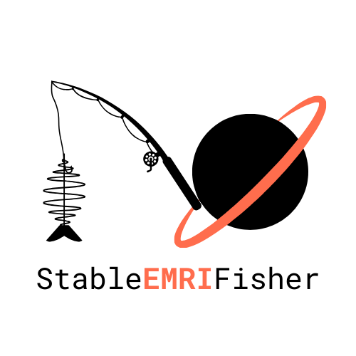

# StableEMRIFisher (SEF)

<div align="center">
  
</div>

**StableEMRIFisher** is a Python package for computing stable Fisher information matrices for Extreme Mass Ratio Inspiral (EMRI) gravitational wave sources. It provides robust numerical derivatives of waveforms and returns Fisher matrices that can be used for accelerated parameter estimation analyses or population inference. StableEMRIFisher uses the [FastEMRIWaveforms](https://github.com/BlackHolePerturbationToolkit/FastEMRIWaveforms) package. Please refer to the [documentation](https://stableemrifisher.readthedocs.io) to know how to get started.

## Key Features

- **Stable Numerical Derivatives**: Robust finite difference methods for parameter derivatives for adiabatic Kerr eccentric equatorial based waveform models.
- **Stability Checks**: Careful validation of numerical stability and convergence of the derivatives. 
- **GPU Acceleration**: Efficient computation for both CPUs and GPUs.
- **Response Function** Utilises [fastlisaresponse](https://github.com/mikekatz04/lisa-on-gpu.git) to efficiently compute the response of the LISA detector to EMRI waveforms.
- **Validated**: Compared against MCMC parameter estimation studies.

## Installation

### Quick Start with UV (Recommended)

[UV](https://github.com/astral-sh/uv) is a fast Python package manager that provides better dependency resolution and faster installs:

```bash
# Install uv if you haven't already
curl -LsSf https://astral.sh/uv/install.sh | sh

# Clone the repository
git clone https://github.com/perturber/StableEMRIFisher.git
cd StableEMRIFisher

# Create virtual environment and install dependencies
uv venv
uv sync --dev

# For GPU support (Linux x86_64 only)
uv sync --extra cuda12x --dev
```

### Alternative: Manual Setup with UV

```bash
# Create virtual environment
uv venv

# Install in development mode (CPU only)
uv pip install -e ".[docs,dev]"

# Or install with GPU support (Linux x86_64 only)
uv pip install -e ".[cuda12x,docs,dev]"
```

### Development Installation with Conda/Pip

If you prefer traditional package managers:

```bash
# Create and activate environment (Python 3.10+ required)
conda create -n sef_env python=3.12
conda activate sef_env

# Clone and install
git clone https://github.com/perturber/StableEMRIFisher.git
cd StableEMRIFisher
pip install -e ".[docs,dev]"
```

### GPU-Accelerated Installation

For GPU acceleration, install with CUDA support. **Note**: GPU support requires Linux x86_64 systems with NVIDIA GPUs and appropriate CUDA drivers.

**Using uv (recommended):**
```bash
# For CUDA 12.x (Linux x86_64 only)
uv sync --extra cuda12x --dev

# Or manually with pip interface
uv pip install -e ".[cuda12x,docs,dev]"
```

**Using pip:**
```bash
# For CUDA 11.x (Linux x86_64 only)
pip install -e ".[cuda11x]"

# For CUDA 12.x (Linux x86_64 only)  
pip install -e ".[cuda12x]"
```

### Common UV Development Commands

Once installed with UV, you can use these commands for development:

```bash
# Run tests
uv run pytest

# Format code
uv run black .
uv run isort .

# Lint code
uv run pylint stableemrifisher/

# Build documentation
cd docs && uv run make html

# Add new dependencies
uv add numpy  # adds to main dependencies
uv add --dev pytest  # adds to dev dependencies

# Update dependencies
uv lock --upgrade

# Sync environment (install from lock file)
uv sync --dev
```

### Verify Installation

Test that everything is working:

```bash
# With UV
uv run python -c "import stableemrifisher; print('✅ StableEMRIFisher imported successfully')"

# Check GPU support (if installed)
uv run python -c "
try:
    import cupy as cp
    print(f'✅ GPU support available: {cp.cuda.is_available()}')
except ImportError:
    print('ℹ️  GPU support not available (CuPy not installed)')
"

# Run a quick test
uv run pytest tests/ -v  # if you have tests
```

**StableEMRIFisher with the LISA response**

- First install `lisaanalysistools` by following the instructions [here](https://github.com/mikekatz04/lisa-on-gpu.git). If using GPUs, install from source.
- Second install `fastlisaresponse` by following the instructions [here](https://github.com/mikekatz04/LISAanalysistools.git). If using GPUs, install from source.

## Documentation

**Full documentation is available at [stableemrifisher.readthedocs.io](https://stableemrifisher.readthedocs.io)**

- [Installation Guide](https://stableemrifisher.readthedocs.io/en/latest/installation.html)
- [Quick Start Tutorial](https://stableemrifisher.readthedocs.io/en/latest/quickstart.html)
- [API Reference](https://stableemrifisher.readthedocs.io/en/latest/api/)
- [Examples](https://stableemrifisher.readthedocs.io/en/latest/examples.html)
- [Validation Studies](https://stableemrifisher.readthedocs.io/en/latest/validation.html)

### Building Documentation Locally

```bash
# Install documentation dependencies
uv pip install -e ".[docs]"

# Build documentation
cd docs
uv run make clean
uv run make html

# View documentation
open _build/html/index.html  # macOS
# or 
xdg-open _build/html/index.html  # Linux
```


## Contributing

We welcome contributions! Please:

1.  **Report bugs** via [GitHub Issues](https://github.com/perturber/StableEMRIFisher/issues)
2.  **Suggest features** through issue discussions
3.  **Submit pull requests** with improvements
4.  **Improve documentation** and examples

## Citation

If you use StableEMRIFisher in your research, please cite:

```bibtex
@software{kejriwal_2024_sef,
  author       = {Shubham Kejriwal and
                  Ollie Burke and
                  Christian Chapman-Bird and
                  Alvin J. K. Chua
                  },
  title        = {StableEMRIFisher (SEF)},
  publisher    = {Github},
  year         = "manuscript in preparation",
  url          = {https://github.com/perturber/StableEMRIFisher}
}
```

Please also cite [FastEMRIWaveforms](https://github.com/BlackHolePerturbationToolkit/FastEMRIWaveforms) and other dependencies as appropriate.

## License

This project is licensed under the MIT License - see the [LICENSE](LICENSE) file for details.

## Support

- **Questions**: Open a [GitHub Discussion](https://github.com/perturber/StableEMRIFisher/discussions)
- **Bug Reports**: Submit a [GitHub Issue](https://github.com/perturber/StableEMRIFisher/issues)
- **Documentation**: Visit [stableemrifisher.readthedocs.io](https://stableemrifisher.readthedocs.io)

## Acknowledgments

Development supported by:
- Centre National de la Recherche Scientifique (CNRS)
- National University of Singapore

Special thanks to the FastEMRIWaveforms development team and the LISA Consortium.
