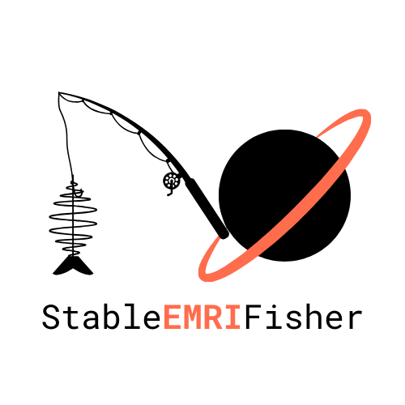

SEF: StableEMRIFisher
==============================

Stable EMRI Fisher Matrix Calculator
------------------------------------

StableEMRIFisher (SEF) is a Python package for computing stable Fisher information matrices using finite-differencing for Extreme Mass Ratio Inspiral (EMRI) waveform models on both CPUs and GPUs.

The Fisher information matrix has elements: 

.. math::

   \Gamma_{ij} := \Bigg(\partial_i h(t;\boldsymbol{\theta})\Bigg|\partial_j h(t;\boldsymbol{\theta})\Bigg)
   
where 

.. math::

   \partial_i h(t;\boldsymbol{\theta}) := \frac{\partial h(t;\boldsymbol{\theta})}{\partial \theta^i}.
   
We calculate this derivative for a given parameter :math:`\theta^i` using a stable numerical derivative scheme.

Stable Numerical Derivatives
----------------------------

A gravitational waveform from an EMRI system at infinity is given by

.. math::

   h(t;\boldsymbol{\theta}) = h_+ - ih_\times = \sum_{l,m,n,k} A_{lmnk}(t;\boldsymbol{\theta}) \exp(-i\Phi_{mnk}(t;\boldsymbol{\theta}))

Here :math:`A_{lmnk}` are the slowly varying amplitudes and :math:`\Phi_{mnk}` are the slowly evolving phases.
Parameter derivatives are given by

.. math::

   \begin{align}
   \partial_{i}h(t;\boldsymbol{\theta}) &= \sum_{lmnk} (\partial_{i}A_{lmnk} -i A_{lmnk}\partial_{i}\Phi_{mnk})\exp(-i\Phi_{mnk}(t;\boldsymbol{\theta})) \\
   \partial_{i}h(t;\boldsymbol{\theta}) &= \sum_{lmnk} A_{lmnk}^{\prime}\exp(-i\Phi_{mnk}(t;\boldsymbol{\theta}))
   \end{align}

with effective amplitudes :math:`A_{lmnk}^{\prime} = \partial_{i}A_{lmnk}(t;\boldsymbol{\theta}) -i A_{lmnk}\partial_{i}\Phi_{mnk}`.

These effective amplitudes are constructed using finite differences and then splined. The oscillatory waveform is then built using the 
effective amplitudes :math:`A^{\prime}_{lmnk}` and the original phases :math:`\Phi_{mnk}`. This method avoids direct finite differencing of the oscillatory waveform,
resulting in more stable numerical derivatives. 

.. note::
   This package requires the latest (v2.0.0) FastEMRIWaveforms (FEW) package to be installed. 
   Installing StableEMRIFisher will install FastEMRIWaveforms by default (for both CPU and GPU).
   See the installation guide for details.

.. toctree::
   :maxdepth: 2
   :caption: Contents:

   api/index
   installation
   quickstart
   validation/validation
   contribution
   citation

Key Features
------------

* **Stable Numerical Derivatives**: Robust finite difference methods for parameter derivatives
* **GPU/CPU Support**: Efficient computation on both CPU (NumPy) and GPU (CuPy) backends
* **EMRI Waveforms**: Integration with FastEMRIWaveforms for accurate EMRI modeling
* **Fisher Information Matrix Analysis**: Complete parameter estimation uncertainty analysis
* **LISA Noise Models**: Built-in support for LISA detector noise characteristics
* **Validation Tools**: Comparison utilities against MCMC parameter estimation

Getting Help
------------

* Check the :doc:`quickstart` guide for a detailed walkthrough
* Browse the :doc:`tutorials/index` for in-depth examples
* Refer to the :doc:`api/index` for complete API documentation

Indices and tables
==================

* :ref:`genindex`
* :ref:`modindex`
* :ref:`search`
